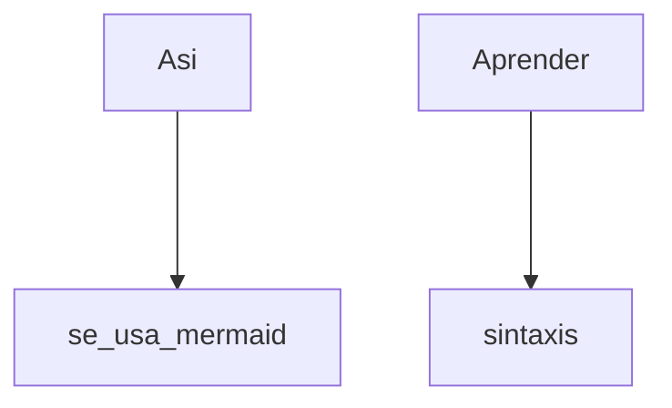

[UTN]
_Elementos a tomar en cuenta para formatos gráficos o de ecuaciones_
Averiguar por Mermaid y Latex

----
Latex se utiliza así
Para generar ^ es _ALT_ + 94
$$ |a_7+b^8-  |\int ax*ad \sqrt{5} \lim_{x \to \infty} \sum^5_4 etc 
$$
